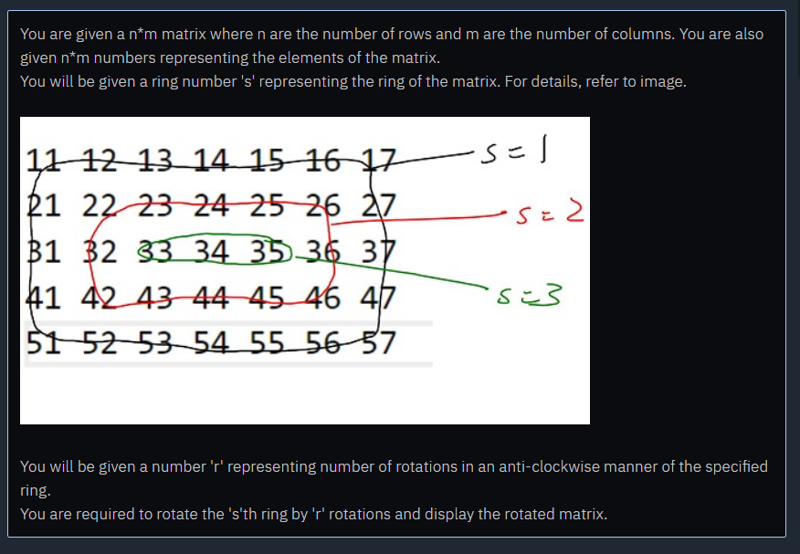

Input Format

A number n

A number m

e11

e12..

e21

e22..

.. n * m number of elements of array a

A number s

A number r

Output Format

output is handled by display function

Constraints

1 <= n <= 10^2

1 <= m <= 10^2

-10^9 <= e11, e12, .. n * m elements <= 10^9

0 < s <= min(n, m) / 2

-10^9 <= r <= 10^9

