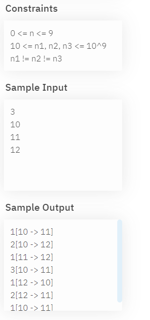

1. There are 3 towers. Tower 1 has n disks, where n is a positive number. Tower 2 and 3 are empty.
2. The disks are increasingly placed in terms of size such that the smallest disk is on top and largest disk is at bottom.
3. You are required to
   3.1. Print the instructions to move the disks.
   3.2. from tower 1 to tower 2 using tower 3
   3.3. following the rules
   3.3.1 move 1 disk at a time.
   3.3.2 never place a smaller disk under a larger disk.
   3.3.3 you can only move a disk at the top.

Note -> The online judge can't force you to write the function recursively but that is what the spirit of question is.Write recursive and not iterative logic. The purpose of the question is to aid learning recursion and not test you.

Input Format

A number n, representing number of disks

A number n1, representing id of tower 1

A number n2, representing id of tower 2

A number n3, representing id of tower 3

Output Format

n[n1 -> n2]

..

A set of instructions in above format to represent, move nth disc from n1 tower to n2 tower

